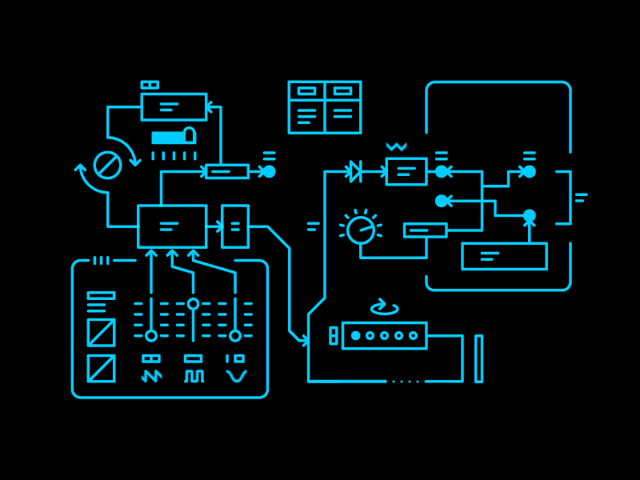

## Hi there 👋

Thanks for making it to my profile!

Welcome to the humble haven of a passionate programmer. Feel free to ask questions and share ideas. If you are open-minded and driven by tech enthusiasm, we can make a good team.

<!--
**patonik/patonik** is a ✨ _special_ ✨ repository because its `README.md` (this file) appears on your GitHub profile.

Here are some ideas to get you started:

- 🔭 I’m currently working on ...
- 🌱 I’m currently learning ...
- 👯 I’m looking to collaborate on ...
- 🤔 I’m looking for help with ...
- 💬 Ask me about ...
- 📫 How to reach me: ...
- 😄 Pronouns: ...
- ⚡ Fun fact: ...
-->
